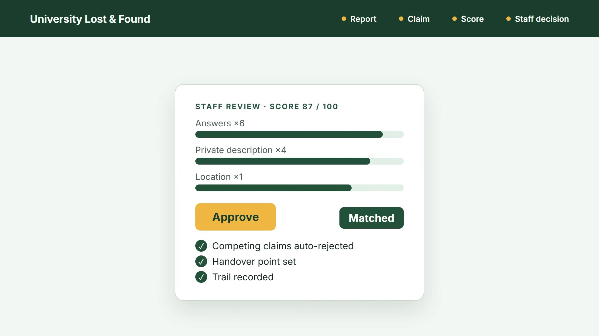
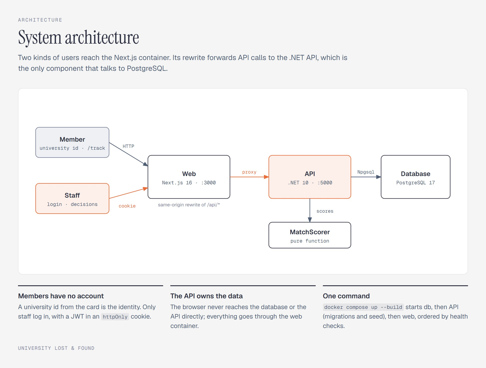
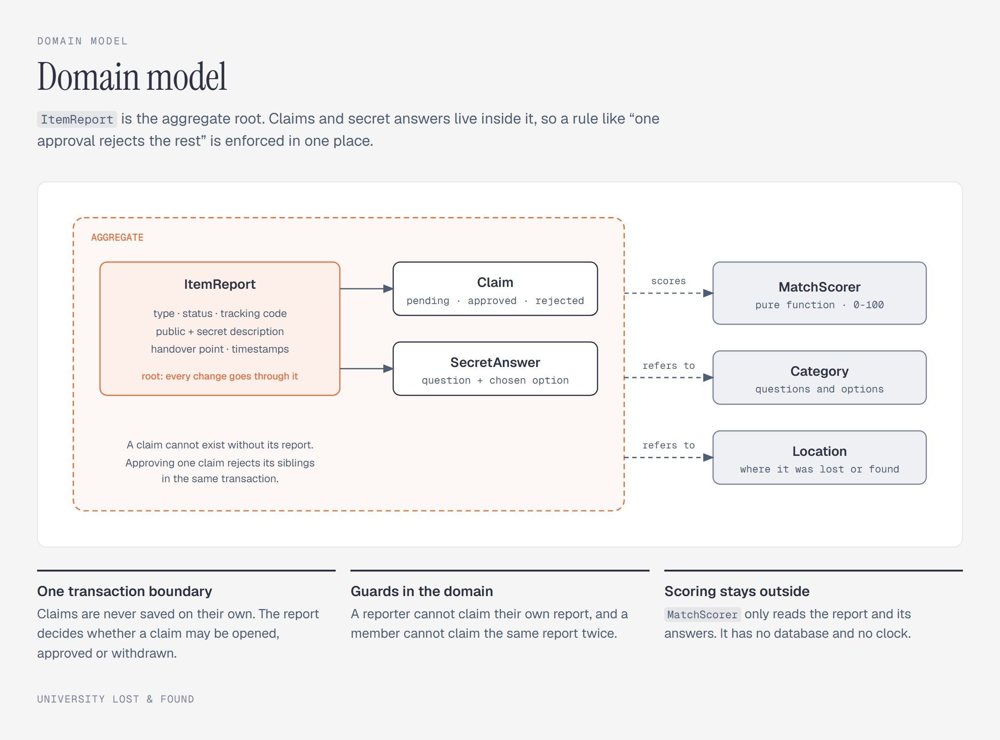
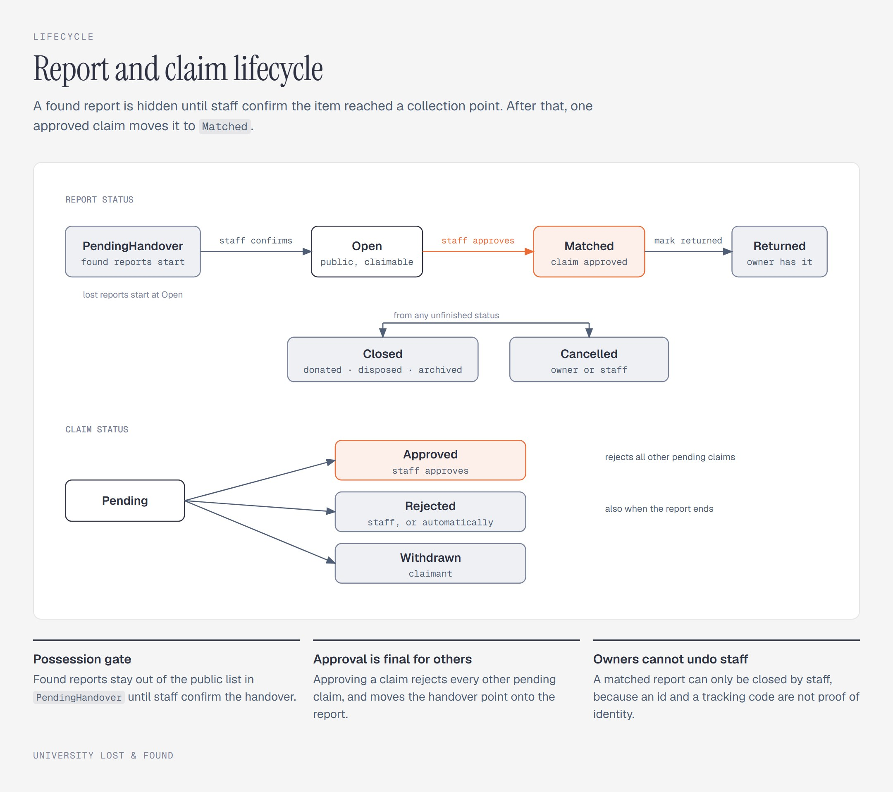
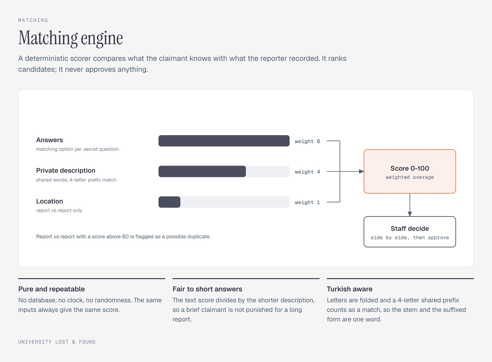

# University Lost & Found

A university lost-and-found service: someone reports a lost item, someone else claims it, the system
scores the claim against the report's private details, and a staff member makes the call. The
digital layer never hands over an item — it ranks candidates, records the handover and leaves a
trail.



- `backend/` — .NET 10 Web API (Clean Architecture, EF Core + PostgreSQL, FluentValidation, Serilog)
- `frontend/` — Next.js 16 (App Router, TypeScript strict, Tailwind, Vitest)

## How it works

1. **Report.** A lost or found report has a public half (category, title, description, location,
   date) and a private half (a secret description and answers to that category's questions). The
   reporter gets a tracking code such as `LF-853673`.
2. **Possession gate.** A found report starts as `PendingHandover` and stays out of the public list
   until staff confirm the item physically reached a collection point.
3. **Claim.** Whoever has the item — or lost it — opens a claim and answers the same secret
   questions in their own words. Claiming a lost report means "I have it", so the claimant picks the
   handover point.
4. **Score, don't decide.** A deterministic scorer compares the answers (weight 6), the private
   descriptions (weight 4) and the location (weight 1) and produces a 0–100 score. It only ranks.
5. **Staff decision.** Staff see both answer sets side by side with the score breakdown, then
   approve or reject with a note. Approving matches the report, auto-rejects the competing claims
   and moves the handover point onto the report.
6. **Track and close.** The owner follows the report at `/track` with their university id and tracking
   code — the only place their own secret details are shown — and can cancel it themselves. After
   the physical handover, staff mark it returned or close it.

University members have no account: a university id (`UM-730164`) is the identity, and it is issued with the
physical card. Only staff log in.

## Run everything with Docker

Prerequisite: Docker Desktop (or Docker Engine + Compose v2).

```bash
docker compose up --build
```

| What      | URL                           |
|-----------|-------------------------------|
| Frontend  | http://localhost:3000         |
| API docs  | http://localhost:5000/scalar  |
| Health    | http://localhost:5000/health  |
| Postgres  | localhost:5432 (universitylostfound / universitylostfound) — `POSTGRES_PORT=55432 docker compose up` if 5432 is taken |

Migrations and the seed run at startup. Outside Development the seed refuses to run unless `Seed__StaffPassword` is private and 12+ characters; `/scalar` and `/openapi` exist only in Development. The seed loads 7 categories, 27 questions, 142 options,
12 locations, university members, visitors, two staff accounts and a few example reports. It is
idempotent; for a clean database run `docker compose down -v` first.

**Demo credentials (fictional):** staff `UM-204718`, password `staffdemo123`. Local demo only. University members for the public flows: `UM-730164`, `UM-482915`. `UM-806521` is an expired
visitor and is rejected on purpose.

## Run locally without Docker

Prerequisites: .NET 10 SDK, Node.js 22, a PostgreSQL 17 instance (`docker compose up db` is enough).

```bash
# backend — http://localhost:5000
cd backend
dotnet run --project src/Api

# frontend — http://localhost:3000
cd frontend
cp .env.example .env.local
npm ci
npm run dev
```

## Environment variables

| Variable | Used by | Note |
|---|---|---|
| `ConnectionStrings__Default` | API | Npgsql key-value form. A `postgresql://` URL is **not** parsed. |
| `Database__MigrateOnStartup` / `Database__SeedOnStartup` | API | Double underscore. Unreadable means `false`, silently. |
| `Jwt__SigningKey` | API | At least 32 bytes. The compose default is local-only. |
| `Seed__StaffPassword` | API | Sets the seeded staff password. |
| `Cors__AllowedOrigins__0` | API | Only needed when the browser calls the API cross-site. |
| `RateLimiting__PermitsPerHour` | API | Defaults to 150 per client IP. `/health` is exempt. |
| `API_URL` | Frontend | Where the API lives. Read at **build** time by the `/api/*` rewrite and at runtime by server components — set it for both. |

Fictional values live in `.env.example` and `frontend/.env.example`. No real secret is in the
repository.

## Checks (run these before every push)

```bash
# backend
cd backend
dotnet format --verify-no-changes
dotnet build -c Release          # warnings are errors
dotnet test -c Release           # 129 unit + 74 integration (in-memory SQLite, no Docker needed)

# frontend
cd frontend
npm run lint && npm run format:check && npm run typecheck && npm test && npm run build
```

On Windows `npm run format:check` reports false positives because of line endings; the real check is
`npx prettier --check --end-of-line auto .`

CI runs exactly these plus a Docker build of both images and a secret scan.

## Known limitations

- Migrations never run in CI: the integration tests use SQLite with `EnsureCreated()`, so a broken
  migration can pass green. Real PostgreSQL is verified by hand with `docker compose down -v`.
- There is no per-university-id daily quota; abuse is bounded by the domain rules and the per-IP hourly
  limit.
- Failed-login and failed-tracking lockouts (5 / 10 per 15 min per university id) are in memory, per API
  instance: scaling out multiplies the cap and a restart clears it. Locking by id also lets someone
  lock a victim out for 15 minutes.
- `X-Forwarded-For` is honoured only from `Proxy:TrustedNetworks` (private ranges by default). If your
  proxy has a public address, list it, otherwise every caller shares one hourly bucket.
- No server-side session revocation (the staff token lives 8 h) and no staff-management screen:
  accounts and passwords are changed in the database.
- Search uses `ILIKE`, not full-text search.
- A university id is an identifier, not proof of identity.

## Layout

```
backend/
  src/Domain          entities and domain rules — no dependencies
  src/Application     use cases (handlers), validators, repository interfaces
  src/Infrastructure  EF Core DbContext, repositories, migrations, seed, clock
  src/Api             controllers, error mapping (ProblemDetails), auth, rate limiting, DI
  tests/UnitTests     Domain + Application, no I/O
  tests/IntegrationTests  real HTTP against the API with in-memory SQLite
frontend/
  src/app             routes (App Router)
  src/features/<x>    one folder per feature: api.ts, types.ts, components, tests
  src/lib             shared infrastructure (API client)
```

## Database migrations

```bash
cd backend
dotnet tool install -g dotnet-ef        # once
dotnet ef migrations add <Name> --project src/Infrastructure --startup-project src/Api --output-dir Persistence/Migrations
```

Migrations are applied on startup when `Database:MigrateOnStartup` is `true` (Development and
Docker), so there is no need to run `database update` by hand locally.

## Diagrams

### System architecture


### Domain model


### Report lifecycle


### Matching engine

